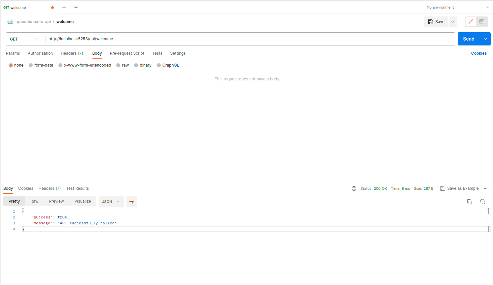
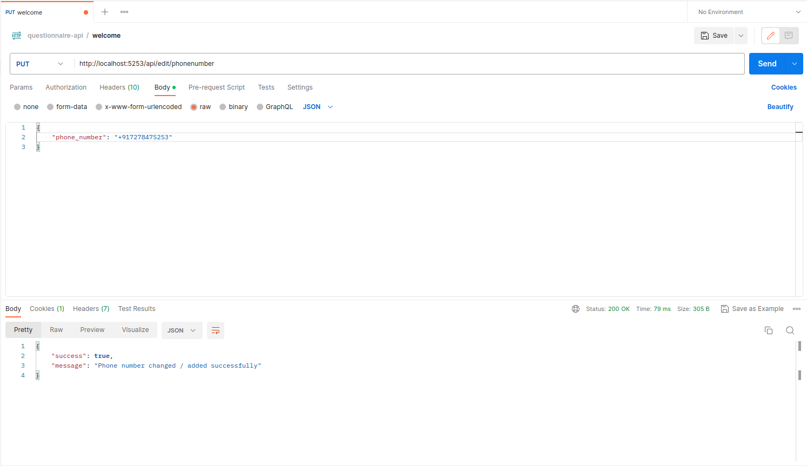
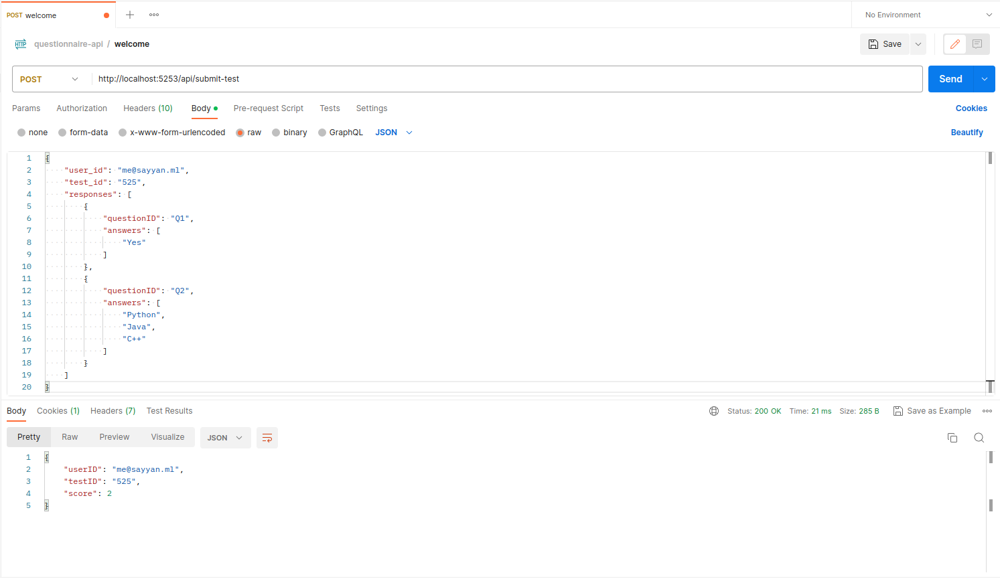
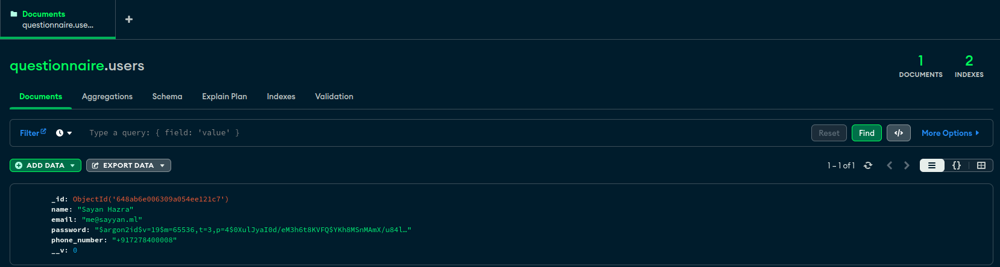
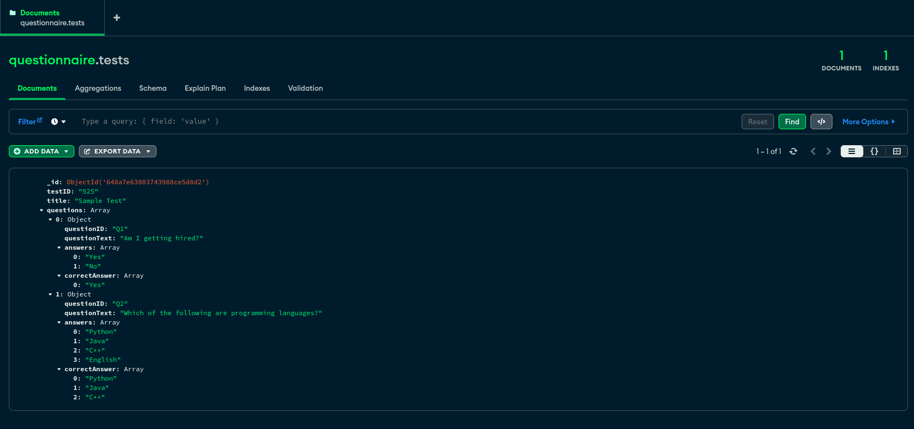
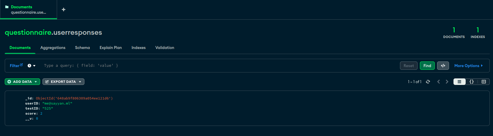

## API Documentation for Questionnaire System

### [API Endpoints] - 

| Endpoint                | Method | Status Code | Time     | Size  | Description                      |
|-------------------------|--------|-------------|----------|-------|----------------------------------|
| /api/welcome            | GET    | 200 OK      | 8 ms     | 287 B | Welcome API                      |
| /api/signup             | POST   | 201 Created | 151 ms   | 291 B | Signup API                       |
| /api/login              | POST   | 200 OK      | 1344 ms  | 533 B | Login API                        |
| /api/edit/phonenumber   | PUT    | 200 OK      | 79 ms    | 305 B | Edit Phone Number API            |
| /submit-test            | POST   | 200 OK      | 21 ms    | 285 B | Submit Test API                  |

### [API's Postman ScreenShots] -

+ #### Welcome (GET) API

+ #### Signup (POST) API

+ #### Login (POST) API

+ #### Edit Phone Number (PUT) API

+ #### Submit Test (POST) API

### [MongoDB Database] -

---

---
